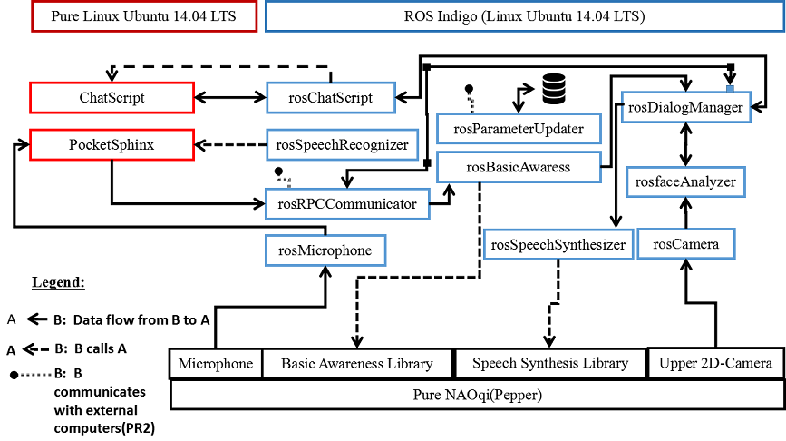

.. note:: 
    Zur Dokumentation: Die Dokumentation soll so geschrieben sein, dass sie später anderen eine gute Übersicht über unser System gibt und dessen Nutzung vereinfacht. Wir sollen alle Komponenten unseres Systems (alle Features, die es so gibt oder Teile der Architektur, z.B. welche Dateien was enthalten, welche Regler es gibt...) beschreiben. Dabei helfen auch Grafiken, wie die Komponenten untereinander verbunden sind. Die Beschreibung soll eher auf "Highlevel"-Ebene sein, d.h. was die Features ungefähr machen und wo man sie findet, eine API ist nicht notwendig. Jeder sollte die von ihm entwickelten Features nach Möglichkeit selbst beschreiben!
    Memo: Die Notiz am Ende bitte wieder entfernen =)

=============
Dialog System
=============

This software allows the Pepper robot to hold a human-like conversation in the SUTURO16 Project from the Institute of Artificial Intelligence -University of Bremen.
The task of the robot in the project consists in taking care of the clients in a Cafe. The robot welcomes the clients, informs them about the Cafe services, takes their orders, forwards them to the robot baker and informs the clients on the evolution of their requests. 

Architecture
----------

    
                                                 **Fig1. Dialog System Architecture**

Face Recognition
----------

Ros-based Image Streaming
----------

Speech Recognition
----------

Gstreamer-based Audio Streaming
----------

Basic Awareness
----------

System Core
----------

ChatScript
----------

Speech Synthesis
----------

RPC-Client
----------

RPC-Server
----------

Parameter Update
----------

Utility
----------

Installation and Start
----------
