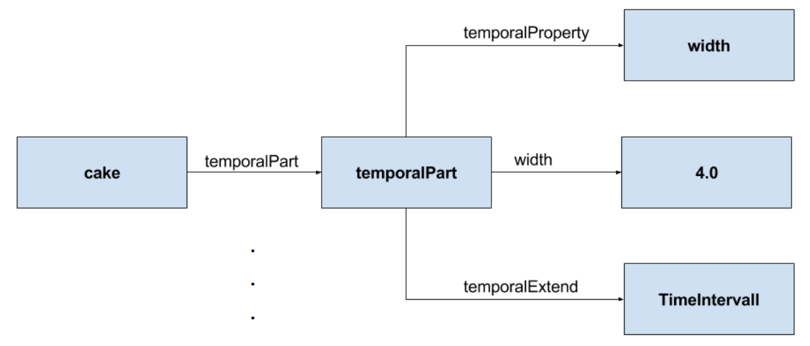
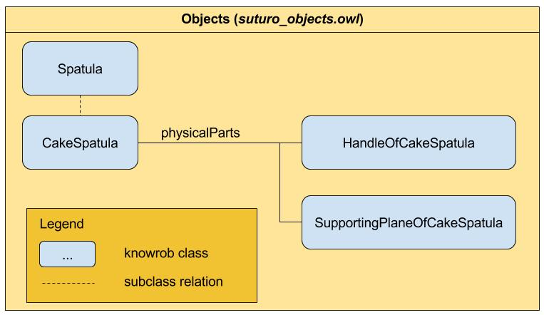
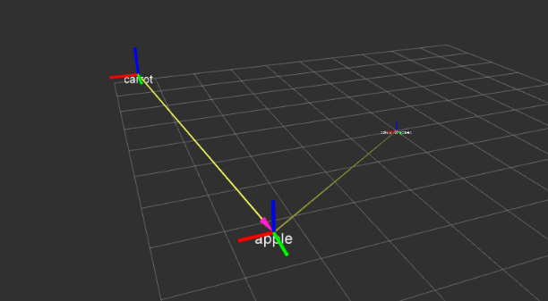

=============
Knowledge
=============

The knowledge modules are basically about storing information and making it accessable in an easy way. 
Part of these information surely are about the world and its objects. For robots it is crucial to use these information, especially about objects, in order to interact with them. Another part of the information stored is information emerging from a spoken dialog. Intentions about a dialog for example, are stored in the knowledge base. 

Installation
----------
To install the knowledge system to your workspace, you need clone the repository to the src folder of your workspace. 
The easiest way to do this, is to copy the following lines into your terminal and replace the path with your local path.
Make sure that you have created a workspace before executing the following commands.

.. code-block:: bash
    :caption: setup
	
	cd ~/suturo16/suturo_ws/src/
	git clone git@github.com:suturo16/knowledge.git
	cd ../
	catkin_make

World state
----------

The world state comprises of the important concepts.

1. Temporal Parts of Objects
''''''''''''''''''''''''''''

When storing spatial information about objects, it is crucial to connect these information to a certain point in time because it is the only way to enable the knowledge base to reason over new and old data respectively. In the picture below you can see how temporal parts are structured in KnowRob.

Due to this concept it is possible for objects in KnowRob to have their attributes connected to a specific point in time. 

2. Physical Parts of Objects
'''''''''''''''''''''''''''''

To improve on the modelling concept of objects in KnowRob, physical parts were introduced. Objects now consist of subobjects. For example a cake spatula consists of two subobjects for its handle and for its supporting plane. This is useful because sometimes you want to grasp specific parts of an object. In case of the cake spatula you probably wanna grasp it at its handle, therefore it is easier to just lookup the pose of the handle instead of the object itself, which is defined as the center of the object. Despite the fact, that this way of representing objects is more plausible from a modelling side of view, it also makes it easier to store constants for specific offset values that belong to a physical part of an object. The illustration below provides an example of a cake spatula object in KnowRob.

Physical parts save spatial information about themselves, like the pose for example, relative to the position of their parents.
The spatial information are automatically handled by the publishing module, which will be described later in this documentation.

3. Connecting Frames
'''''''''''''''''''''
Since it is very difficult to recognize objects that are currently in the gripper of the robot, we came up with this solution.
Once an object is successfully grasped by the PR2, we execute the connect_frames function. This way the knowledge base has the information that the object is gripped and more importantly, new perceptions of the grasped object type are ignored. The position of the grasped object is now published relative to the gripper position. This way the knowledge base always knows where the grasped object is. When the object is dropped, the disconnect_frames function allows new perceptions of the object again, so that the position of the object will automatically update itself again.

Receiving of Perceptions
''''''''''''''''''''''''''''

The perception group publishes their perceptions to this topic: "`percepteros/object\_detection"'.
The knowledge group implemented a subscriber for this topic to process the published data internally. The subscriber can be found in the knowledge package named object_state/scrips/subscriber.py. Following the flow of the subscriber, the acquired information are then internally handled by the object_state.pl module, where the KnowRob objects are created and published. The publishing of spatial information about objects is described in the next section. 

Publishing of Perceptions
''''''''''''''''''''''''''''

After creating the KnowRob representation of the perceived data, spatial information about the objects are published to the tf topic.

The python script object_state/scripts/fluents_tf_publisher.py creates a ROS node to transform the poses of objects. In a first step the required information for the transformation such as Name, FrameID, Pose and Orientation are queried, using the prolog function get_tf_infos(). The result of the transformation is forwarded to the tf topic by the publisher, making it accessable for manipulation.

CaterROS Cafeteria Modelling
----------

Pepper and openEASE
----------

Prython
----------

There are a lot of different packages for calling Java code from Prolog, but we wanted to take advantage of the scipting functionalities of Python inside our code. With that in mind, a library for the purpose of calling Python from Prolog was programmed internally. At first the library started an interpreter each time a call was made, that was clearly ineficient and after some strenuous coding and optimizing the library it got almost 30 times faster than its first version. It was now feasible and even fast making calls, thanks to Prython. 

ROS specific Protege
---------

For working with models and its capabilities Protégé, from the Stanford University, proved to be an excelent tool. With it it is easy to edit and view the OWL ontology files. The program was clearly not made with ROS environments in mind though, it can't handle any dynamic for example. As their code is completely open source we forked the repository and modified some parts of it to handle our dynamic paths, automatically recognizing the package path and selecting the appropriate files. That way we could spend less time looking for the right folders and more time adding new functionality.
