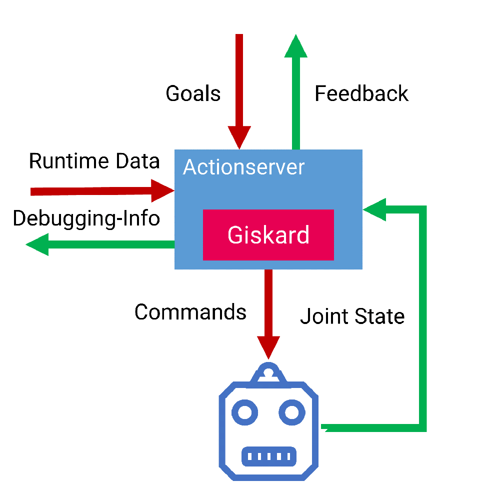

=============
Manipulation
=============

Welcome to the documentation page of the manipulation components used in the CaterROS project! On this page we provide installation instructions for the system, an overview over our components and instructions on how to use them.

Installation
============
To install the manipulation system to you workspace, you need clone the repository to the source folder of your workspace. After that you can use `wstool` to install the needed dependencies.

.. code-block:: bash
    :caption: HTTPS

    cd ~/path_to_my_ws/src
    git clone https://github.com/suturo16/manipulation.git
    wstool merge manipulation/dependencies.rosinstall
    wstool update

If you have an ssh key setup for the use with GitHub, you can also use the ssh to clone the repository and its dependencies.

.. code-block:: bash
    :caption: SSH

    cd ~/path_to_my_ws/src
    git clone git@github.com:suturo16/manipulation.git
    wstool merge manipulation/ssh.rosinstall
    wstool update

All that's left to do now, is build your workspace once using catkin.

System Overview and Usage
=========================
Overall the system provides the ability to use the constraint based motion frame work `Giskard` to move the PR2 robot, as well as a variety of controllers needed for the CaterROS scenario. The heart of the system is our custom action server. It requires a controller and assignments for the conroller's parameters as goals and uses these to generate commands to move the robot. During the execution, the server outputs feedback and debug information. The feedback includes a value calculated within the controller that rates how well the overall goal of the controller is satisfied. 
Additionally, the repository provides a couple of tools for manually testing controllers.

    
    An overview of the structure and communication of the suturo action server. 

Using the Action Server
-----------------------
The action server executable is provided by the :code:`suturo_action_server` package and is called :code:`suturo_action_server`. On startup it loads its configuration and a robot description from the parameter server. The configuration must be provided by the parameter :code:`config` within the node's namespace and is parsed as a yaml configuration. The configuration can declare exceptions for the handling of specific joints.

.. code-block:: yaml
    :caption: Example configuration for the PR2

    position_controllers:
        head_tilt_joint: /head_tilt_position_controller/command
        head_pan_joint: /head_pan_position_controller/command
    gripper_controllers:
        r_gripper_joint: /r_gripper_controller/command
        l_gripper_joint: /l_gripper_controller/command
    joint_state_command_topic: /js_command
    visualization_target_frame: base_link

In some cases it might be neccessary to control certain joints using position commands instead of velocitiy commands. These joints can be specified using :code:`position_controllers` map of the configuration. In this map the names of the names of joints are associated with the names of the topics on which the position commands should be published.

Another exception that can be managed by the action server are grippers. These are assumed to be controlled using the *control_msgs/GripperCommand* message. The joints that are to be treated as grippers, can be specified in the :code:`gripper_controllers` map. 

The parameter :code:`joint_state_command_topic` specifies a topic on which the commands are published as *sensor_msgs/JointState*. This is mainly a feature to make the server compatible with the current version of the `iai_naive_kinematics_sim <https://github.com/code-iai/iai_naive_kinematics_sim>`_.

The parameter :code:`visualization_target_frame` determines the name of the frame that all threedimensional visualization will be published in. By default this value is set to :code:`base_link`.

Executing a Controller
''''''''''''''''''''''
The action server requires a goal of type `suturo_manipulation_msgs/MoveRobotGoal`.

.. code-block:: bash
    :caption: suturo_manipulation_msgs/MoveRobotGoal

    string[] controlled_joints  #All the joints to use for this action
    string controller_yaml      #The complete content of the generated controller yaml
    string feedbackValue
    suturo_manipulation_msgs/TypedParam[] params

The argument :code:`controlled_yaml` contains the controller string. :code:`feedbackValue` specifies the name of a scalar value within the controller that is included in the feedback message. The parameter assignment for the controller is defined in the :code:`params` list.
The argument :code:`controlled_joints` can be ignored, as it only exists for legacy reasons.

Parameter Assignment
''''''''''''''''''''
Parameter assignments are transmitted to the action server in the form of a *suturo_manipulation_msgs/TypedParam*. 

.. code-block:: bash
    :caption: suturo_manipulation_msgs/TypedParam

    uint8 DOUBLE=0       # Scalar data
    uint8 TRANSFORM=1    # Transformation data
    uint8 ELAPSEDTIME=2  # Time since the start of controller's execution in seconds
    uint8 VECTOR=3       # Vector data
    uint8 VISUALIZE=4    # Parameter contains a visualization rule

    bool isConst    # Is the value constant
    uint8 type      # Type of the parameter
    string name     # Name of input in controller
    string value    # Value of this assignment

Parameters have a name, a type, a flag marking them as constant and a value. If the parameter is supposed to be assigned to an input of a controller, it's name has to match the input's name. In this case the type argument also to match the type of the input. Out of Giskard's four elementary datatypes, three are supported at the moment: Scalars, vectors and transformations. Each parameter can be marked as either constant or dynamic. Constant parameters are only assigned once, during the start of the controller, and will not be updated again. Dynamic parameters are updated during every controller update cycle. Currently, only dynamic updates for transformations are supported.  

.. IMPORTANT::
    Joints are handled automatically! They are updated each control cycle even when they are not being controlled.  

The way the action server interprets the :code:`value` string of the message depends on the parameter's type and its :code:`isConst` flag. The formatting for constant values is the following:

  - Scalar: :code:`VALUE`, e.g. :code:`1.0`
  - Vector: :code:`X Y Z`, e.g. :code:`1 2.5 -3.9`
  - Transformation: :code:`X Y Z AX AY AZ ANGLE`, e.g. :code:`1 2.5 -3.9 1 0 0 3.1415`

Dynamic transformation parameters cause the server to do a TF-lookup each update cycle. The frame's names are encoded as :code:`TARGET_FRAME SOURCE_FRAME`. 

A special type of parameter is the clock parameter. The clock assigns the elapsed time since the start of the current controller to a scalar input in the controller. This value can be used to generate motions based on the passing of time. An example could be a nodding or waving motion. It should be noted that this parameter will only be interpreted when it's :code:`isConst` flag is set to :code:`false`. The :code:`value` attribute of the parameter is not used.

Additionally to the parameters assigning values to controller inputs, there are parameters that can be used to configure the action server. 

The first of these special parameters can be used to configure the effort that should be used to command a gripper. To set this effort, the name of the parameter has to match the name of a controlled gripper. The parameter's value will then be decoded as scalar and used to fill the :code:`effort` field of the *control_msgs/GripperCommand* message.

The second type of special parameters is marked by the type value :code:`VISUALIZE`. These parameters define visualization rules for values from the controller's scope. The visualization is refreshed during each controller update cycle. The visualization system supports scalars, vectors and transformations. Vectors and transformations are visualized using *visualization_msgs/MarkerArray* messages which are published on the topic :code:`visualization` within the server's namespace. Scalars are published in the form of *suturo_manipulation_msgs/Float64Map* on the topic :code:`debug_scalar` within the server's namespace.

The :code:`value` field of the parameter specifies which value should be visualized. Frames are always visualized relative to the frame named by :code:`visualization_target_frame`. Vectors can be visualized either as points, also relative to :code:`visualization_target_frame`, or as vectors. To do so, the name of another vector must be provided 
that will serve as base point for the direction vector. This done by seperating the names of the vectors in the :code:`value` string with a space, e.g. :code:`DIRECTION BASE`. The vector will also be visualized relative to :code:`visualization_target_frame`.

Automated Behavior
''''''''''''''''''
The action server has some automated behavior that is triggered by the successful construction of a new controller. 

The first part of this behavior aims to aid developers with the debugging of controllers by allowing them to specify values to visualize directly within the controller's code. This way, the visualization is always active without the need to always transmit the visualization parameters for each controller. Because Giskard does currently not support the attachment of custom data to the controllers, the action server recognizes the values to visualize by their names. When a value's name begins with the prefix :code:`VIS__` the action server will mark it for visualization. In the visualized data, the value's name will lose the prefix. The name of the base point for the visualization of vectors is also specified in the value's name and is separated by a double underscore (:code:`__`). 

So to visualize the *Z* unit vector with the name *up*, you'd put the line :code:`VIS__up__ZERO: unitZ` in the scope of your yaml controller file. Prerequisites for this to work are of course that the vectors :code:`ZERO` and :code:`unitZ` are defined within your controller.

The second automated behavior of the server tries to ease the usage of collision avoidance in controllers. A subsystem of the server provides a very simple query system for finding points in the environment that are closest to the robot. After finding these points, the algorithm provides the point closest to a link and the corresponding point on the link's surface. These two points can then be used inside of controllers for very simple collision avoidance. 

The action server uses the names of a controller's inputs to automatically determine which link's of the robot should be queried for by the algorithm. If an input is meant to be used for collision avoidance, it's name must follow this naming convention :code:`COLL:(L|W):[LINK NAME]`. The :code:`L` and :code:`W` define whether this input is supplying the point on the robot's link or in the world. The :code:`LINK NAME` needs to be the name of a link defined by the robot's URDF.

Collision Avoidance
----------
What does it do:
The collision avoidance tries do avoid collisions with point clouds. The point clouds are converted to octrees to accelerate this process. This is done by the Octomap_server package. After that the collision avoidance finds the closest cell of the octree to each link of the collision query. If this distance drops under a certain threshold it is maximized to avoid the collision.

Usage:
Additionally to the Actionserver you have to launch the octomap_server package. You can do that by running roslaunch suturo_action_server octomap_mapping.launch. The octomap_server package listens for point clouds on the topic */kinect_head/depth_registered/points*. This can be changed in the launch file. After the octomap_server was launched the Actionserver should automatically use the collision avoidance for controllers with collision queries.

Testing and Tools
=================
The *manipulation* repository contains a few tools for easier development and testing of controllers. This section will introduce them.

Client for Easy Controller Testing
----------------------------------
In addition to the action server itself, the *suturo_action_server* package also provides a simple test client that loads parameter assignments from yaml files. This way users don't have to build the goal messages for the action server by hand for every test.

.. code-block:: bash
    :caption: Call Pattern for the Test Client

    rosrun suturo_action_server client_test <Controller File> <Parameters.yaml> <Feedback Value>

The parameters' file must contain a list of yaml dictionaries, which have to match the following keys:

.. code-block:: YAML
    :caption: Parameter Dictionary in yaml

    name: <String>
    type: double | transform | elapsedtime | vector | visualize
    const: true | false
    value: <String>

The argument :code:`Feedback Value` provides the name of the value that is logged to the action server's feedback topic. 

During our controller development, we defined aliases wihtin our bash environment for common client runs. This way we could test the manipulation aspect of our system without the need for higher level components.  

Mass Checking of Controllers
----------------------------
The *suturo_action_tester* package provides the *controller_checker* executable that recursively searches a folder for controller files and uses them to generate controllers. If problems arise during this process, the error messages are displayed. At the end of the execution, the number of all found controller files and the number of successfully generated controllers are displayed. All of the successfully generated controller's inputs are logged to a file called *controller_interfaces*, which is created in the directory, the checker is executed in.
The tool was initially developed to easily find controllers which were faulty because of a giskard language update.
The checker currently uses the yaml language, as well as the two custom languages developed for the CaterROS project.

.. code-block:: bash
    :caption: Call Pattern for the Controller Checker

    rosrun suturo_action_tester controller_checker <PATH 1> <PATH 2> ....

Mockup Environment
------------------
Aside from the controller checker, the *suturo_action_tester* package also provides a Python node called *ObstacleScene* and an RVIZ panel called *Suturo Simulation Panel*. Together, these two provide a very simple test environment that allows users to build and save scenarios using interactive markers in RVIZ. The data of these markers is published to TF and can be used by the action server.

.. NOTE::
    These two systems are deprecated and only being documented here for the sake of completeness. The `giskard_ide <https://github.com/aroefer/giskard_ide>`_ package should be used for this purpose now.

Controllers
===========
a list including every controller with documentation can be found `here <http://suturo-docs.readthedocs.io/en/latest/implementierung/schnittstellen.html#controller>`_

Languages
=========
The *giskard_suturo_parser* package contains two parsers for custom controller languages that were developed during the CaterROS project. 

The goal of the first language was to have a language that was more readable than the yaml language provided by the giskard library. The language is designed to work well with Python syntax highlighting in regular text editors. For brevities sake, we will refer to this language as GLang. Systems loading controllers from disk associate the suffix *.giskard* with GLang.
The structure of a controller file for this language is very simple. 

.. code-block:: python
    :caption: Structure of a GLang File

    scope = {
        value1 = someExpression;
        ...
        valueN = someOtherExpression
    }    

    controllableConstraints = {
        controllableConstraint(lowerLimit, upperLimit, weight, "Name1");
	    controllableConstraint(lowerLimit2, upperLimit2, weight2, "Name2")
    }

    softConstraints = {
        softConstraint(lowerLimit, upperLimit, weight, expression, "Some name");
        softConstraint(lowerLimit2, upperLimit2, weight2, expression2, "Some other name")
    }

    hardConstraints = {
        hardConstraint(lowerLimit - someExpression, upperLimit - someExpression, someExpression);
        hardConstraint(lowerLimit2 - someOtherExpression, upperLimit2 - someOtherExpression, someOtherExpression)
    }

The overall form is pretty simple. However note that the last entry of any structure is not followed by a semicolon. A complete list of commands and attributes supported by the language can be found `here <https://github.com/suturo16/manipulation/blob/feature/MS6/giskard_suturo_parser/GLang%20reference>`_.

.. WARNING::
    The GLang parser has an inconsistent evaluation order. The same operators are evaluated from left to right. Otherwise equations are evaluated from right to left. Example: :code:`10 - 5 - 2` is evaluated to :code:`3`; :code:`10 + 5 - 2 + 3` is evaluated to :code:`10` because it is bound as :code:`10 + (5 - (2 + 3))`. A fix for this bug is contained in `this commit <https://github.com/suturo16/manipulation/blob/d7d79ba8ae549873f8e1e1e5126da83b0ef44ec9/giskard_suturo_parser/include/giskard_suturo_parser/giskard_parser.hpp>`_. However it is currently not included in the master, as it will break some of our controllers.

The goal of the second language was to support the modularization of controllers and a definition of custom functions. Together these features are supposed to enable developers to build libraries for giskard controllers and ultimately use these to generate controllers automatically. We'll call it GLang++ from now on (because uncreative naming patterns are a proud tradition). 
GLang++ has not actually been used in controllers used by the CaterROS system.
A first controller using that language has been built for the *fetch* robot. It is part of the `fetch_giskard <https://github.com/ARoefer/fetch_giskard>`_ package and is named `pos_controller.gpp <https://github.com/ARoefer/fetch_giskard/blob/master/test_controllers/pos_controller.gpp>`_.
The file illustrates how GLang++ controllers are structured. A full list of built-in functions of the language can be found `here <https://github.com/suturo16/manipulation/blob/feature/MS6/giskard_suturo_parser/GLang%2B%2B%20reference>`_.
