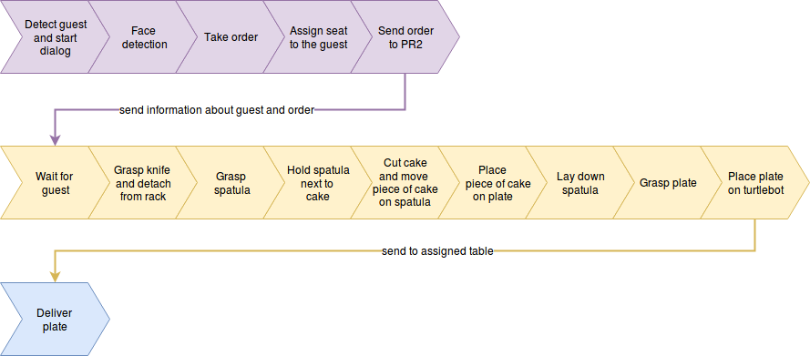

=============
Overview
=============

Vision
----------
The basis for our SUTURO project is the Vision of the CaterROS cafe:

"As Thomas enters the CaterROS cafe, he is greeted by Pepper, the smart robot. During the course of the dialogue with Pepper, Thomas gets assigned a seat. Furthermore, he has the possibility to order one or more pieces of cake. Pepper knows the kitchen roboter Raphael, a PR2, can perform this task. The order will be relayed via RPC, then Raphael can start with its task.

The uncut cake is positioned in front of the PR2. The robot takes a knife with a specifically designed handle from a holder. It then proceeds to cut out a piece of the cake and puts it on a plate.

In the meantime, Thomas can talk to Pepper, he can specify his request (order more cake, have the cake delivered to him, etc.). Peppers function will be that of a waiter.

When the PR2 has cut the cake and placed it on its plate, it will send that information to Pepper. Pepper will then tell Thomas that his order is ready. Depending on Thomas' order, the plate will be delivered to him by a turtlebot, or he will be asked to get the plate himself."

Scenario
----------
Taking our vision as a guideline, we developed all the features needed to realize the CaterROS cafe.
You can see a step-by-step visualization of the resulting scenario in the following picture: 

The purple steps are related to Pepper, the yellow ones to the PR2 and the blue step is related to the Turtlebot. The arrows show the flow of information between the robots. 

Whenever a guest approaches, Pepper will detect them and start a dialog. Additionally, Pepper has a face detection included which enables it to recognize people it knows already. New people can tell it their name or decide to stay unknown. Guests that order an amount of pieces of cake get registered and the corresponding information (their guest id and the amount of pieces of cake they ordered) is send to the PR2. Pepper then assigns a table to the guest. The PR2 is waiting for guests to arrive and whenever it gets to know about guests that still need pieces of cake, it starts to prepare the order. Therefore, it grasps a knife from the rack and detaches it. Next, it grasps a spatula and holds it next to the cake. It then cuts a piece of cake from the cake in front of it and pushes it on the spatula using the knife. Then, it can lift the spatula, place it over the plate that is laying nearby and flips the spatula so that the piece of cake falls on the plate. The process of holding the spatula next to the cake, cutting a piece of cake and placing it on the table is repeated as many times as are needed for the given order. Afterwards, it lays down the spatula to be able to grasp the plate. After it placed the plate on the turtlebot, it sends the turtlebot the command to bring it to the table where the guest is waiting. The turtlebot drives to the given location and the guest can get the plate from it.

The only part of the scenario that is still not working properly is the preparing of orders with more than one piece of cake. The feature is already implemented, the only thing missing to make it work is the repetition of the perception process after the cutting of a piece of cake. After a piece of cake was cut, the cake gets smaller. Without knowing that, the PR2 is not able to cut any more pieces of cake properly. 

Architecture
----------

Here you can see the overall architecture of the CaterROS system: 

.. figure:: system.png

The round figure is the module concerning Pepper, the rectangular figures are the modules concerning the PR2. The Planning module is the only one also concerning the turtlebot. The arrow direction describes the direction of information flow and the corresponding color the module actively requesting or sending information. So for example the blue arrow from Knowledge to Planning means that Planning asks Knowledge about object or guest information and receives them from Knowledge. 

The Dialog System running on Pepper is the user interface of the CaterROS system. This module enables the robot to recognize faces and to understand spoken words in realtime. Whenever an order is made, the Dialog System sends the corresponding information to the Planning module. Planning is responsible for the management within the CaterROS system. It organizes the tasks needed to be executed by the PR2 and the turtlebot to fullfill a particular goal: serving a given amount of pieces of cake to a specific table. Therefore it uses the interfaces of the other groups. 
The information concerning the order is sent from Planning to Knowledge, the module that contains and manages all information extracted from the robots' environment, including data about perceived objects as well as guest and order data. 
Objects within the reach of the PR2's camera are recognized by the pipeline of the Perception module. The pipeline can be started by the planning module whenever an update of the perceived environment is needed. Knowledge saves the corresponding data and makes it accessible for Planning. To make the PR2 act, Planning uses the controllers provides by the Manipulation module. Using the information received from Knowledge, Planning can call the controllers for grasping objects, cutting cake, etc. The Manipulation's controllers use additional information from the Knowledge module. The navigation of the turtlebot is, on the other hand, realized by Planning itself. 
