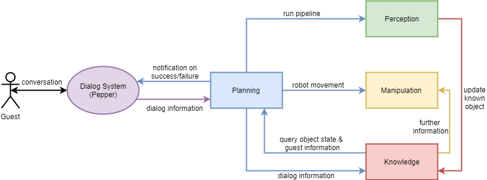

=============
Overview
=============

Vision
----------
As Thomas enters the CaterROS cafe, he is greeted by Pepper, the smart robot. During the course of the dialogue with Pepper, Thomas gets assigned a seat. Furthermore, he has the possibility to order one or more pieces of cake. Pepper knows the kitchen roboter Raphael, a PR2, can perform this task. The order will be relayed via RPC, then Raphael can start with its task.

The uncut cake is positioned in front of the PR2. The robot takes a knife with a specifically designed handle from a holder. It then proceeds to cut out a piece of the cake and puts it on a plate.

In the meantime, Thomas can talk to Pepper, he can specify his request (order more cake, have the cake delivered to him, etc.). Peppers function will be that of a waiter.

When the PR2 has cut the cake and placed it on its plate, it will send that information to Pepper. Pepper will then tell Thomas that his order is ready. Depending on Thomas' order, the plate will be delivered to him by a turtlebot, or he will be asked to get the plate himself.

Architecture
----------

Here you can see the overall architecture of the CaterROS system: 

