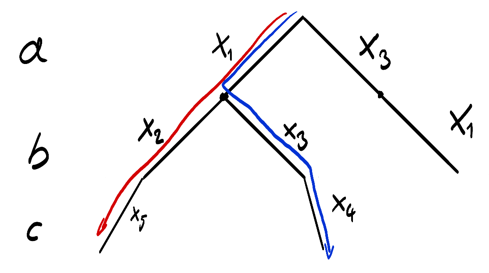

=============
Plangenerator
=============

Der Plangenerator ist ein Modul, das aufgrund eines diskreten Weltzustands eine Lösung für eine beliebeige Aufgabe finden soll, sofern diese existiert. Diese Seite erklärt wie dieses Modul funktionieren soll.


Grundlagen
----------

Zuerst eine Reihe von Begriffen und Konzepten die benötigt werden, um das Problem und den Algorithmus richtig beschreiben zu können.


Prädikat
````````
Ein Prädikat ist ein Ausdruck, der benutzt wird um die Gültigkeit einer Eigenschaft :math:`p` für eine Gruppe von Werten :math:`x_1 \ldots x_n` auszudrücken. 

Beispiele:

.. math::
	
	red('apple') &\rightarrow ist\ 'apple'\ rot \\
	onTop('apple', 'table') &\rightarrow ist\ 'apple'\ auf\ 'table'


Prädikate mit einer konkreten Belegung ihrer Variablen werden *Instanzen* genannt. Im Rahmen des Planungsprozesses gibt es auch Prädikate deren Variablen nur zum Teil belegt sind. Diese nennen wir *Teilinstanzen*. Im Folgenden wird eine Instanz von :math:`p` mit :math:`i_p` und eine Teilinstanz mit :math:`\bar{i}_p` bezeichnet. Im Falle der Instanzen wird der n-ten Wert der Belegung durch einen tiefgestellten index ausgedrückt.   


Zustand
```````
Ein Zustand :math:`S` ist eine Menge von Prädikat-Instanzen. Für alle Instanzen in einem Zustand gilt immer, dass sie nicht wiedersprüchlich sind: :math:`\forall i_p \in S : (\exists h_p: i_{p,1} = h_{p,1} \wedge \ldots \wedge i_{p,n} = h_{p,n}) \rightarrow i_p = h_p`.
Es können also nicht gleichzeitig die Instanzen :math:`red('apple') = true` und :math:`red('apple') = false` in einem Zustand enthalten sein.


Operator
````````
Operatoren modellieren die Fähigkeit des Systems Änderungen in der Welt zu bewirken. Operatoren können sowohl atomare Fähigkeiten, als auch größere Pläne sein. Ein Operator :math:`o(x_1 \ldots x_n)` besteht aus drei Komponenten:

- Eine Vorbedingung :math:`pre_o`, welche eine Menge von Prädikat-Instanzen ist. Damit der Operator arbeiten kann, muss die Vorbedingung erfüllt sein.
- Eine Nachbedingung :math:`post_o`, welche eine Menge von Prädikat-Instanzen ist. Die Nachbedingung drückt einen Zustand aus, welcher nach der erfolgreichen Ausführung des Operators eingekehrt sein wird.
- Einen Kostenpunkt :math:`c_o > 0`, welcher den Aufwand ausdrückt, den ein Operator verursacht.
  
Wie auch bei den Prädikaten, gibt es zwei Varianten von Operatoren. Die parametrisierte Variante von Operatoren drückt nur die Abhängikeit von Vor- und Nachbedingung aus. Die instanziierte Variante eines Operators enthält nur komplette Instanzen von Prädikaten und lässt sich somit ausführen.

Beispiel eines parametrisierten Operators :math:`placeOnTop(a,b)`:

.. math::

	pre_{placeOnTop} &= grasped(a) \wedge inReach(b) \\
	post_{placeOnTop} &= onTop(a, b)


Beispiel einer Instanz von :math:`placeOnTop('apple','table')`:

.. math::

	pre_{placeOnTop} &= grasped('apple') \wedge inReach('table') \\
	post_{placeOnTop} &= onTop('apple', 'table')


Operator-Instanzen können auf Zustände angewandt werden. Diese Anwendung wird durch die Junktoren :math:`\vdash, \dashv` ausgedrückt, wobei :math:`S\vdash_o` die Anwendung der Nachbedingung von :math:`o` auf :math:`S` darstellt und :math:`S\dashv_o` die Anwendung der Vorbedingung.

Beispiel mit dem Operator :math:`placeOnTop('apple', 'table')`

.. math::

	r &= placeOnTop('apple', 'table') \\
	S &= \{grasped('apple'), inReach('table'), \neg onTop('apple', 'table')\} \\
	S \vdash_r &= \{grasped('apple'), inReach('table'), onTop('apple', 'table')\} \\

	R &= \{\neg grasped('apple'), \neg inReach('table'), \neg onTop('apple', 'table')\} \\
	R \dashv_r &= \{grasped('apple'), inReach('table'), \neg onTop('apple', 'table')\}


Planungsproblem
```````````````

Kommen wir nun zum eigentlichen Thema dieser Seite: Dem Planungsproblem. Gegeben seien ein Startzustand :math:`S` und ein Zielzustand :math:`G`, so wird eine Sequenz :math:`P = (o_1,\ldots, o_n), n \geq 0` von Operator-Instanzen gesucht, sodass :math:`S \vdash_{o_1} \ldots \vdash_{o_n} \supseteq G` wobei die Vorbedingung einer jeden Instanz mit der vorhergehenden Produktion kombinierbar sein muss :math:`\forall o_k \in P: pre_{o_k} \subseteq S \vdash_{o_1} \ldots \vdash_{o_{k-1}}`. 
Diese Sichtweise geht davon aus, dass sich alle Probleme sequenziell lösen lassen, und Parallelisierung entweder eine Optimierung darstellt, oder durch einen Operator übernommen wird, wenn sie notwendig ist.


Algorithmus
-----------
Ein möglicher Algorithmus wäre im derzeitigen Zustand alle Operator-Instanzen zu erzeugen, die sich in diesem Zustand erzeugen lassen, ihre Folgezustände zu berechnen und dies auf diesen wieder zu tun. Mit einer Optimierung anhand der Kostenfunktion eines Operators, ließen sich damit alle möglichen Pläne in aufsteigender Reihenfolge ihrer Kosten finden. Allerdings ist dieses Verfahren trotz Optimierung immer noch ein sehr starkes Gestocher im Dunkeln.

Ein etwas zielstrebigerer Algorithmus ist ein Rückwärtsplaner. Dieser versucht eine Plan zu finden, indem er versucht eine Verbindung von Ziel- zu Startzustand zu finden. Der Zielzustand ist immer eine Teilmenge des Startzustandes, da sonst nicht messbar ist, ob ein Ziel erreicht ist. Für gewöhnlich dürfte der Zielzustand nur aus einer verhältnismäßig geringen Anzahl an Eigenschaften bestehen, was den Suchraum stark begrenzt. 


Reverseplanner
``````````````
Das Ziel beim Entwurf dieses Algorithmus ist es, sequenziell und deterministisch Pläne zu erzeugen, die relativ günstig sind. Dass dies sequenziell geschieht, dient der Ressourcenschonung. 

Um sequenziell vorgehen zu können, wird das Problem nicht in einem Zug erschlagen, sondern nach und nach als Teilproblem gelöst. Ein Teilproblem ist hierbei ein Tupel 

.. math::
	
	T = (S_T, G_T, Q_l, Q_r, O_T)

in dem :math:`S_T, G_T` Start- und Zielzustand von :math:`T` sind. :math:`Q_l, Q_r` sind Sequenzen, sodass :math:`S \vdash_{Q_l} = S_T` und :math:`G \dashv_{Q_r} = G_T`. :math:`O_T` ist eine nach Kosten aufsteigend sortierte Sequenz von Operator-Instanzen :math:`o_k`, die auf die Differenz zwischen Start- und Zielzustand anwendbar sind und diese verändern 

.. math::
	
	\forall pre_o \in O_T: G_T \setminus S_T \cap pre_o \neq \emptyset \wedge G_T \setminus S_T \not \subseteq G_T \dashv_o \setminus S_T


Die Kosten eines Planungsproblems und damit auch des möglichen Plans werden durch die Kostenfunktion :math:`\mathcal{C}: T \rightarrow \mathbb{R}` bestimmt. Die Funktion beeinflusst das Verhalten des Algorithmus und die Kosten der Lösung stark, weswegen sie vorsichtig gewählt werden sollte. Ein einfache Funktionen wäre

.. math::

	\mathcal{C}(T) &= \sum\limits_{o \in Q_l} c_o + \sum\limits_{o \in Q_r} c_o \\

welche allerdings unter ungünstigen Umständen sehr teure Pläne produziert.
Mit diesen Definitionen lässt sich nun das Verhalten des Planers beschreiben. Zu Beginn eines neuen Planungsprozesses bekommt der Planer den Start- und Zielzustand übergeben und initialisiert einen neuen Heap mit dem initialen Planungsproblem. Nach der Initialisierung kann der Planer sequenziell Pläne erzeugen. Hierfür entnimmt er das nach :math:`\mathcal{C}` günstigste Teilproblem und wendet die Vorbedingung seines günstigsten Operators auf den Zielzustand des Teilproblems an. Wenn dieser neue Zielzustand keinen Unterschied zum Startzustand des Teilproblems hat, existiert nun eine mögliche Lösung. Diese muss auf ihre Korrektheit geprüft werden. Ist diese erfüllt, gilt das Problem als gelöst und der komplette Plan wird zurückgegeben. Ist eine dieser Eigenschaften nicht erfüllt, so wird ein neues Teilproblem formuliert, das den Startzustand des alten und den neuen Zielzustand hat. Dieses wird auf den Heap gelegt. Wenn noch Operatoren für das alte Problem verfügbar sind, wird auch dieses wieder auf den Heap gelegt.
Wenn der Heap leer ist, sind alle Optionen das Problem zu lösen durchgespielt.

.. code:: cpp

Heap<Partial> H;
State S;
State G;

void init(start, goal) {
	S = start;
	G = goal;

	H = Heap<>();
	H << Partial(S, G, {}, {}, findOps(S, G));
}

Plan getPlan() {
	while(!H.empty()) {
		Partial p = H.pop();
		Operator o = p.O.pop();

		State G_T = o.applyPre(p.G);

		if (G_T / p.S == {} && verify(p.Q_l + o + p.Q_r)) {
			return p.Q_l + o + p.Q_r;
		} else {
			if (!p.O.empty())
				H.push(p);

			H.push(Partial(p.S, G_T, p.Q_l, o + p.Q_r, findOps(p.S, G_T)));
		}
	}

	return 0;
}


Der Pseudocode zeigt eine recht einfache Implmentierung des Algorithmus. Diese kann noch etwas erweitert werden, um frühzeitig unlösbare Probleme zu erkennen. Sobald :math:`\exists p \in G_T \setminus S_T: \forall o \in O: p \not \in post_o` gilt, ist ein Teilproblem unlösbar, da :math:`p` somit entweder eine unveränderbare, oder irreversible Eigenschaft ist. Ein reales Beispiel für eine irreversible Eigentschaft wäre das Aufschlagen eines Eis.

Bis hierhin ist der Algorithmus sehr übersichtlich. Die Hauptherausforderung verbirgt sich jedoch hinter der Ermittlung der möglichen Operator-Instanzen, um ein Teilproblem zu lösen. 

Gegeben die Differenzmenge :math:`D = G_T \setminus S_T`, so scheiden bereits alle Operatoren aus, deren Nachbedingung nicht mindestens einem Element in :math:`D` entspricht. Folglich muss für jeden Operator :math:`\exists \bar{p} \in post_o = i_p \in D` gelten. Für jeden der Operatoren in dieser Vorauswahl müssen nun Belegungen seiner Parameter gefunden werden, um eine Instanz zu erzeugen. Die Menge der möglichen Belegungen kann im schlimmsten Fall exponentiell mit der Anzahl der Prädikate im Operator steigen, weswegen es wichtig ist hier sehr vorsichtig und präzise vorzugehen, um die Anzahl der Möglichkeiten zu reduzieren.

Ein Weg dies zu tun, ist einen Baum zu erzeugen, an dessen Knoten mögliche Instanz der Operatoren stehen. Eine gültige (Teil-)belegung der Parameter des Operators ergibt sich durch das Abgehen aller Äste im Baum. Die Struktur des Baumes wird durch die Parameter des Operators bestimmt. Jeder Parameter entspricht dabei einer Ebene des Baumes. 

Ein Beispiel, um die abstrakte Beschreibung anschaulicher zu machen. Gegeben seien ein Operator :math:`o(a,b,c)` und ein Differenzzustand :math:`D`

.. math::
	
	D &= \{\neg f(x_1, x_2), \neg f(x_1, x_3), \neg f(x_3, x_1), g(x_3, x_4), g(x_2, x_5)\} \\
	pre_o &= \{f(a,b), \neg f(a,c)\} \\
	post_o &= \{\neg f(a,b), g(b,c)\}

Aus dieser Differenz lässt sich folgender Baum erzeugen:



	Belegungsbaum für das Beispiel. Vollständige Belegungen für :math:`a,b,c` in Blau und Rot gekennzeichnet. (Habe noch nicht die Zeit gehabt eine Graphenbibliothek für Sphinx zu finden)

Vollständige Belegungen für :math:`a,b,c` lassen sich nun anhand dieses Baumes ablesen, indem man alle Pfade bis zu den Blättern der :math:`c`-Ebene abgeht.

Im gegebenen Beispiel lassen sich mit dieser einfachen Technik alle vollständigen Instanzen von :math:`o(a,b,c)` finden. Doch dies ist ein Idealfall, der nicht immer gegeben istund  gerade bei Ressourcenmanagement wahrscheinlich nie gegeben sein wird.

[Hier geht's bald weiter...]

TODO - Was noch entwickelt werden könnte
----------------------------------------

Kreisfreiheit
`````````````
Es ist sehr wahrscheinlich dass Kreise beim Planen entstehen können, somit der Planer niemals abbricht, sondern ab einem Punkt nur noch Vielfache des gleichen Plans produziert. Dies ist nur eine Vermutung. Entweder jemand könnte nachweisen, dass diese Vermutung falsch ist, oder man müsste sich eine schnelle Variante überlegen, um Zustände wieder- und somit auch Kreise zu erkennen.

Planvereinigung
```````````````
Wenn man bereits schnell Zustände wiedererkennen kann, könnte man auch Planungsprobleme wiedererkennen und sich somit das mehrfache Lösen eines Teilproblems sparen, was in mehreren Plänen auftritt. Dies verändert den Graphen sehr stark und verändert somit auch die Erzeugung in Verwaltung des finalen Plans.

Teilproblemerkennung
````````````````````
Eine weitere mögliche Nutzung der Problem-Wiedererkennung, ist schnelles Reagieren auf in der Ausführung gescheiterte Pläne.

Parallelisierung
````````````````
Mit dem Planer lassen sich Ressourcen verwalten. Man könnte ein weiteres Modul entwickeln, was in erzeugten Plänen mögliche Parallelitäten erkennt und dem entsprechend die Pläne umformuliert. Dies ist vermutlich die Schwierigste Erweiterung, weil sie zeitlich schätzen können muss. Außerdem ist das Problem definitv NP-hart.  